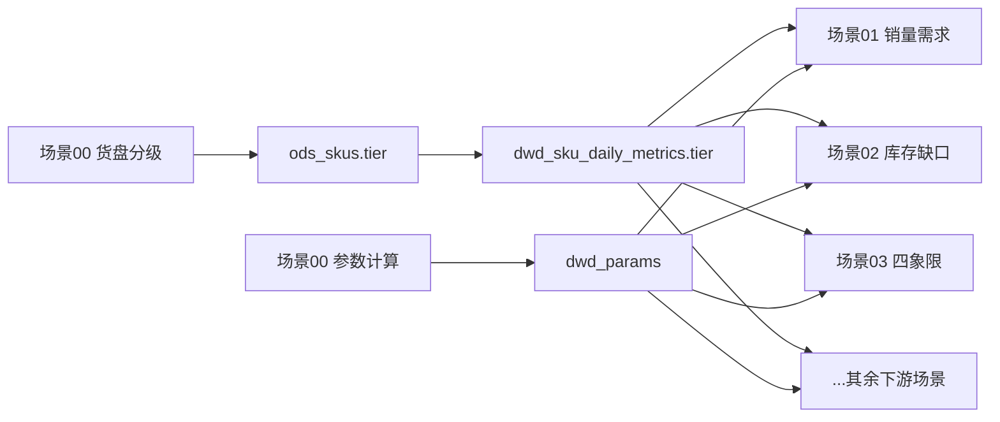

# 场景00 v2.0：货盘分级 + 生命周期

> **产品框架参考**：`references/pmc-product-framework.md`
>
> **执行脚本**：`~/pmc-data/scene00_v2_upgrade.py`（由本 skill 首次运行时写入）

## 消费接口约定（统一输出口）

> **场景00 是下游所有场景的统一 tier/参数来源。下游场景不应直接读取 `ods_skus.tier` 或查询 `ods_params`。**
>
> **销售目标参考**：`references/sales-target-generation.md` — `manual_daily_sale_target` 统一口径及生成公式

### tier 输出路径

1. 场景00 计算货盘分级 → 写入 `ods_skus.tier`
2. DWD 刷新脚本（`refresh_dwd_metrics.py`）将 `ods_skus.tier` 同步到 `dwd_sku_daily_metrics.tier`
3. **下游场景统一通过 `dwd_sku_daily_metrics.tier` JOIN 消费**，禁止直接读 `ods_skus.tier`

```sql
-- ✅ 正确做法：下游场景 JOIN dwd_sku_daily_metrics 获取 tier
SELECT d.sku_code, d.tier, d.weighted_daily
FROM dwd_sku_daily_metrics d
WHERE d.tier = 'S';

-- ❌ 错误做法：下游场景直接读 ods_skus.tier（应由场景00计算 + DWD 层分发）
-- SELECT sku_code, tier FROM ods_skus WHERE tier = 'S';
```

### 参数输出路径

场景00 涉及的参数（P1~P10、生产周期天数）统一通过 `dwd_params` 查询暴露：

| 参数 | 含义 | 来源 |
|:---|:---|:---|
| P1-P5 | Pareto / 类目 / 生命周期 / 退出 / 综合分权重 | `ods_params` → `dwd_params` |
| P7 | 生产周期天数 | `ods_skus.production_cycle_days` → `dwd_params` |
| P8-P10 | 备货/补货/促销参数 | `ods_params` → `dwd_params` |

> **下游场景不应直接查询 `ods_params`**，应通过 `dwd_params` 读取。如需新增参数，统一在场景00 中注册。

### 目标值覆盖规则（固定规则，非参数）

不再使用参数控制目标覆盖策略，统一固定为：

```text
若 manual_daily_sale_target 非空：使用人工目标值
若 manual_daily_sale_target 为空：回落使用 sales_target（系统目标值）
```

### 依赖顺序



## 数据源

DuckDB `${PMC_DB_PATH:-~/pmc-data/pmc_ods.duckdb}`，读写 `ods_skus.tier` 和 `ods_skus.lifecycle`。

| 表 | 关键列 | 用途 |
|:---|:---|:---|
| `ods_sales` | sku_code, daily_qty, sale_date | 近 30 天日销量，Pareto + 类目排名 |
| `ods_skus` | sku_code, tier, lifecycle, launch_date, category | 基础信息 + 写回目标 |
| `ods_params` | param_no, param_default | 业务参数源 |
| `dwd_sku_daily_metrics` | sku_code, tier, weighted_daily | **下游消费口**：tier 通过此表暴露给下游场景 JOIN |
| `dwd_params` | param_no, param_value | **下游消费口**：P1~P10 等参数通过此表查询 |

## v2.0 核心改动

| 能力 | v1.0 | v2.0 |
|:---|:---|:---|
| 货盘分级 | 单一分位数排名 | **4维综合打分**（Pareto + 类目 + 生命周期 + N档退出） |
| 生命周期 | 无 | **5段标签**（新品/成长/成熟/衰退/淘汰），基于 launch_date |
| N档规则 | 简单（Bottom 5%） | **强制退出规则**：零销售30天 + 上架>180天无销售 → N |
| 新品保护 | 无 | launch_date ≤30天的新品退出分=0.3（不直接归零） |

## 计算逻辑

### PART 1: 生命周期标签

基于 `launch_date` 与今天日期的天数差 + 近30天销售状态：

| 生命周期 | 判定条件 |
|:---|:---|
| **新品** | launch_date ≤ 30天 |
| **成长** | 30 < launch_date ≤ 90天 且有近期销售 |
| **成熟** | 90 < launch_date ≤ 365天 且有近期销售 |
| **衰退** | 90天以上无近期销售，或 365-730天有少量销售 |
| **淘汰** | launch_date > 730天 且无近期销售 |

- launch_date 为空时，保持原 lifecycle 值不变
- "有近期销售" = 近30天 total_30d > 0

### PART 2: 货盘分级 — 四维打分

#### 维度1: Pareto 贡献分（权重 35%）

按近30天销量降序排列，累计贡献百分比打分：

| 累计贡献 | 分数 |
|:---|:---|
| ≤ 50% | 1.0 |
| 50-80% | 0.8 |
| 80-95% | 0.5 |
| 95-100% | 0.2 |
| 无销售 | 0.0 |

#### 维度2: 类目内排名分（权重 30%）

每个 category 内按销量排名，百分位打分：

| 类目内百分位 | 分数 |
|:---|:---|
| Top 5% | 1.0 |
| 5-20% | 0.8 |
| 20-50% | 0.5 |
| 50-80% | 0.3 |
| 80-100% | 0.1 |

#### 维度3: 生命周期倾向分（权重 20%）

| 生命周期 | 基础分 | 有销售加成 |
|:---|:---|:---|
| 成熟 | 1.0 | - |
| 成长 | 0.7 | +0.3（有销售时） |
| 新品 | 0.3 | +0.3（有销售时） |
| 衰退 | 0.3 | - |
| 淘汰 | 0.0 | - |
| 未知 | 0.2 | - |

#### 维度4: N档退出规则（权重 15%）

| 条件 | 分数 | 效果 |
|:---|:---|:---|
| 30天内零销售 且 launch_date > 30天 | 0.0 | **强制归N**（跳过加权） |
| 30天内零销售 且 launch_date ≤ 30天 | 0.3 | 新品缓冲 |
| launch_date > 180天且零销售 | 0.0 | **强制归N** |
| 其他 | 1.0 | 正常参与加权 |

> **规则优先级**：退出分 = 0.0 → 直接归 N，不参与后续加权和分位数分段。

#### 综合分公式

```
composite = 0.35 × Pareto + 0.30 × Category + 0.20 × Lifecycle + 0.15 × Exit
```

若 Exit = 0.0，直接 N。

非零分 SKU 按 composite 降序分位数分段：

| 货盘 | 分位数区间 | 标签 |
|:---|:---|:---|
| S | Top 5% | 爆款 |
| A | 5%~20% | 畅销 |
| B | 20%~50% | 平销 |
| C | 50%~90% | 长尾 |
| N | 90%~100% | 淘汰/无销售 |

### PART 3: 写回

一次性 `UPDATE FROM` 临时表：

```sql
CREATE TEMP TABLE _scene00_results (sku_code, new_tier, new_lifecycle);
-- 批量 INSERT 10K/批
UPDATE ods_skus
SET tier = r.new_tier,
    lifecycle = r.new_lifecycle,
    updated_at = NOW()
FROM _scene00_results r
WHERE ods_skus.sku_code = r.sku_code;
```

> **注意**：写入 `ods_skus.tier` 后，DWD 刷新脚本（`refresh_dwd_metrics.py`）会将其同步到 `dwd_sku_daily_metrics.tier`。**下游场景必须通过 `dwd_sku_daily_metrics.tier` JOIN 消费，禁止直接读 `ods_skus.tier`。**

## 执行步骤

```bash
python3 ~/pmc-data/scene00_v2_upgrade.py
```

脚本自动完成：数据加载 → 生命周期计算 → 综合打分 → 写回 → 验证。

## 输出格式

```
场景00 v2.0 货盘刷新完成 @ 2026-05-20

=== 生命周期分布 ===
  新品:    5,002  (2.9%)
  成长:   92,846 (53.9%)
  成熟:    2,233  (1.3%)
  衰退:   65,646 (38.1%)
  淘汰:    6,625  (3.8%)

=== 货盘分布（4维综合打分）===
| 等级 | SKU数 | 占比 |
|------|-------|------|
| S    |   197 |  0.1%|
| A    |   591 |  0.3%|
| B    | 1,181 |  0.7%|
| C    | 1,575 |  0.9%|
| N    | 168,808 | 97.9%|

> N 占比高是正常的：17.2万SKU中仅2400个有近30天销售记录。
```

## 渠道交付策略

> 共享交付模块：`~/workspace/pmc-agents/scripts/pmc_delivery.py`

### 渠道判断
- **飞书 / Telegram**：支持文件附件 → 生成 Excel 明细
- **终端 / TUI**：纯文本 → 输出 Markdown

### 场景判断
场景00 输出为简单的汇总统计（生命周期分布 + 货盘分布），**不生成 PDF 报告**。核心产出是写入 DB 的 tier/lifecycle 标签，下游通过 `dwd_sku_daily_metrics` 消费。附加 Excel 仅作为交付副产品。

### Excel 明细映射

| Sheet | 内容 | 关键列 |
|:---|:---|---|
| 生命周期分布 | 5段生命周期的SKU数分布 | 生命周期, SKU数, 占比 |
| 货盘分布 | S/A/B/C/N各等级分布 | 货盘等级, SKU数, 占比, 累计占比 |
| 综合打分明细 | 每个SKU的四维打分详情（可选） | sku_code, product_name, pareto_score, category_score, lifecycle_score, exit_score, composite, tier, lifecycle |

### 执行流程
1. 运行场景00分析SQL，写入 `ods_skus.tier` + `ods_skus.lifecycle`
2. 查询聚合结果：生命周期分布 + 货盘分布
3. 调用 `pmc_delivery.detect_channel()` 判断渠道
4. 若支持附件：调用 `pmc_delivery.render_dataframe_to_excel()` 生成 Excel（含以上 Sheet），发送到当前渠道，附加简短文字摘要
5. 若不支持附件：输出 Markdown 纯文本

## 下次运行

脚本文件会在首次执行时写入 `~/pmc-data/scene00_v2_upgrade.py`。若文件不存在，根据本 skill 的计算逻辑重新生成。
